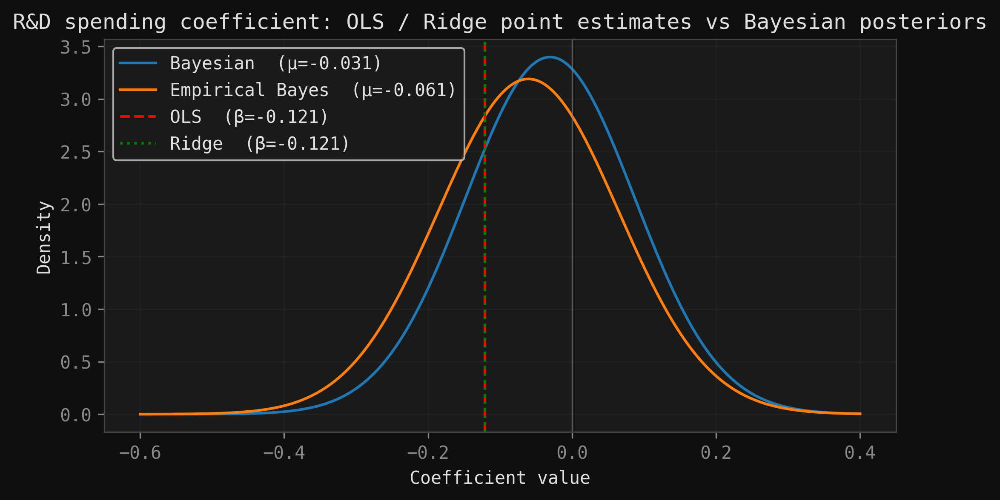

# Bayesian Linear Regression in Econometrics

<p align="center">
  
  
  
  
  
  
</p>

<p align="center">
  
</p>

A from-scratch derivation and implementation of **Bayesian linear regression** and
its relatives (OLS, Ridge, Empirical Bayes), placed on a single common axis. The
project shows that a flat prior recovers OLS, a zero-mean Gaussian prior is exactly
Ridge, and Empirical Bayes learns the prior strength from the data by maximizing the
marginal likelihood. A real-world economic dataset (innovation, R&D, firm
performance) serves only as an illustration to make the shrinkage and
uncertainty-quantification mechanics visible.

## Repository structure

```
.
├── data/
│   ├── raw/                 # original WBES indicator files
│   └── processed/           # cleaned cross-section + data dictionary
├── img/                     # figures used in the notebook & README
├── modules.py               # OLS / Ridge / Bayesian / Empirical Bayes classes
├── notebook.ipynb           # main analysis (derivations + experiments)
├── cholesky_decomposition.md
└── README.md
```

## Objective

Classical OLS becomes unstable with small samples, correlated regressors, or high
estimation variance. The goal is **methodological**: derive and implement a Bayesian
framework that treats coefficients as distributions, quantifies their uncertainty
(credible intervals), and regularizes weak, poorly identified coefficients via
shrinkage — then show how OLS, Ridge, and Empirical Bayes are all special cases of
the same idea.

## Data & Stack

- **Data:** World Bank Enterprise Surveys (WBES) 2023, cross-section of economies.
  Target = real annual sales growth; predictors = R&D spending and product
  innovation (firm shares, %).
- **Stack:** Python, NumPy, SciPy, pandas, matplotlib / seaborn, Plotly. All
  estimators implemented from scratch (no statsmodels / scikit-learn fitting).

## Results

Using the R&D coefficient as a running example:

| Method | R&D $\hat\beta$ | Std. Error |
|---|---|---|
| OLS | −0.121 | 0.129 |
| Ridge ($\lambda=1$) | −0.121 | 0.129 |
| Bayesian | −0.031 | 0.117 |
| Empirical Bayes | −0.061 | 0.125 |

Shrinkage pulls the weak, noisy R&D coefficient toward the prior (−0.12 → −0.03)
while the strong product-innovation effect stays stable, and all standard errors
shrink — trading a little in-sample fit for more robust uncertainty.

## How to run

```bash
pip install numpy pandas scipy matplotlib seaborn plotly
jupyter notebook notebook.ipynb
```

Run the cells top to bottom. Models can also be imported directly:

```python
from modules import OLSRegression, BayesianRegression, RidgeRegression, EmpiricalBayesianRegression
```

## Notes

- The economic dataset is illustrative only — the focus is the statistical method,
  not an economic conclusion.
- Empirical Bayes estimates a point value of $\tau^2$ from the data; it is not a
  fully Bayesian treatment (no hyperprior), and can overfit if used carelessly.
- The log marginal likelihood uses a Cholesky factorization for numerical stability
  (see `cholesky_decomposition.md`).
